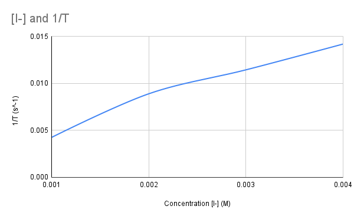

Kevin Zhang
Lab Report 4

#### Introduction

The goal of this lab is to study the rate of reaction as it relates to concentration. In this lab, we will be performing the Iodine Clock reaction with varying concentrations of Iodine. 

#### Chemical Responsibility

Most of the chemicals in this lab don't have significant health hazards. The only exception is Ammonium Persulfate, which is a strong oxidizer.

#### Report Sheet 

**Order of Reaction**

Reaction Temperature: 20.0$^{\circ}$C

| Rxn # | [I-] (M) | T (s)  | 1/T (s^-1)     |
| ----- | -------- | ------ | -------------- |
| 1     | 0.004    | 70.42  | 0.01420051122  |
| 2     | 0.003    | 68.68  | 0.01456027956  |
| 2*    | 0.003    | 87.31  | 0.01145344176  |
| 3     | 0.002    | 112.31 | 0.008903926632 |
| 4     | 0.001    | 234.77 | 0.00425948801  |

2* is a reaction taken from classmate -- our rxn #2 results did not seem to conform with other rxns.

Graphs

Based on these graphs, the order of the reaction is first-order. 

**Effect of Temperature on Reaction Rate**

Reaction Temperature: 36.0$^{\circ}$C

[$I^-$] = 0.001 M

Time = 53.07 sec

The reaction at this temperature is 4.42 times faster than run #4

#### Sample Calculations

$$
\text{mol of }I^- = \frac{1 \text{ mol of }I^-}{1 \text{ mol of }KI} \times 20.3 mL \times \frac{1 L}{1000 mL} \times \frac{0.100 \text{ mol of }KI}{1 L} = 0.00203 \text{ mol} \\
\text{total volume} = (20.3 mL + 0mL +9.9mL +19.6mL) \times \frac{1 L}{1000 mL} = 0.0498 L \\
[I^-]_{(1)} = \frac{\text{mol of }I^-}{\text{total volume}} = \frac{0.00203\text{ mol}}{0.0498L} = 0.004 M
$$

#### Discussion of Results

The results indicate that the iodine-clock reaction is a first-order reaction. Which is to say that the coefficient in the rate law for Iodine is equal to 1 ($r = k[I^-]$). The reaction also increases its speed when heated. 

#### Post-Lab Questions

1. What are the units of the rate constant for a first-order reaction?
   $s^{-1}$
2. True or False: The rate law must be experimentally determined
   True
3. How does an increase in temperature affect the rate of a chemical reaction?
   Increasing the temperature increases the rate of the reaction (speeds it up).
4. Why was it important to mix your solution in the proper sequence, with the ammonium persulfate last?
   The persulfate is the other key component to the reaction. Once the persulfate is added, the clock can start ticking.
5. Why was it necessary to add KCl solution to some of your experimental mixtures?
   The KCl solution is added when we decrease the KI solution in order to keep the ionic concentration constant. 
6. Why did your solution turn bluish-purple after a short period of time?
   The solution changes color when the Iodine reacts with starch. The duration of time is because the thiosulfate immediately consumes any initial iodine produced. Once the thiosulfate is used up, any excess Iodine reacts with the starch.
7. Why was it necessary to add sodium thiosulfate to your experimental mixtures?
   The thiosulfate is the "clock" in this reaction. When the $I^-$ reacts with the persulfate, $I_2$ is immediately produced, which would color the reaction instantly. To delay this, the thiosulfate reacts with the $I_2$. Since there is a constant amount of thiosulfate across all the runs, when the thiosulfate runs out, we can measure how long the reaction took.
8. Your experimental solution turns bluish-purple immediately after persulfate? What did you do wrong?
   You forgot to add thiosulfate.

#### Conclusion

In conclusion, the rate of the Iodine-clock reaction can be experimentally determined by varying the concentration of KI, while keeping all other factors as constant as possible.